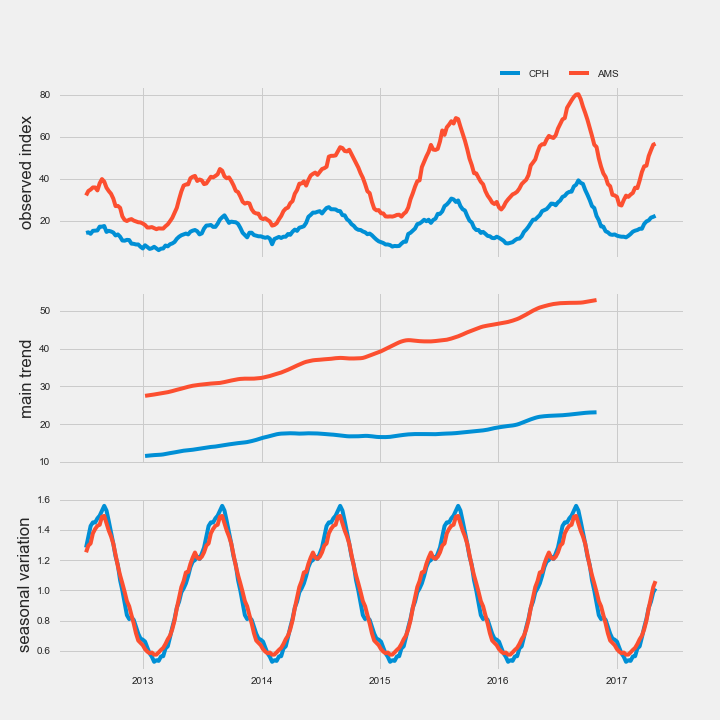

# OpenTourism
Hackathon Project at Open Tourism Days

*Complete tutorial on How I analysed the data will be here soon.*

### The number of bikes passing a counter in an hour 
*Data from Copenhagen Data http://data.kk.dk/dataset/faste-cykeltaellinger*

Locations of the counters  
[Interactive plot](http://threeninetynine.com/open-tourism/gmap_plot.html)

Everyday in 2014  

Weekends and Holidays  

How does tempeature affects the number?

### The decomposition of relative index of Google search for 'bike rental' in Copenhagen and Amsterdam
*Data from Google Trends https://trends.google.com/trends/explore?q=copenhagen%20bike%20rental,amsterdam%20bike%20rental*

  

### GoBike Usage
*Data from GoBike*

[Interactive plot](http://threeninetynine.com/open-tourism/GoBike_plot.html)

### Bus Stops Coverage
*Data from Open Data http://portal.opendata.dk/dataset/busstoppesteder*

[Interactive plot](http://threeninetynine.com/open-tourism/bus_plot.html)
